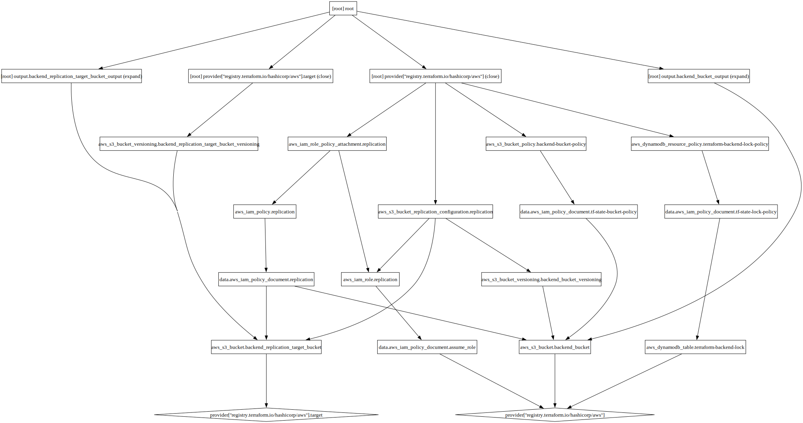

# Terraform S3 Remote Backend Boostrap

This Terraform configuration sets up a robust backend infrastructure for Terraform state management, including:
- S3 bucket for state storage with versioning
- Cross-region replication to a secondary S3 bucket
- DynamoDB table for state locking
- IAM roles and policies for replication

## Prerequisites

**Important:** Before running this Terraform configuration, you must have:

1. **An existing IAM role or user** that will be granted access to the backend resources
   - This role/user ARN will be specified in the `terraform_trusted_role_arn` variable in your `terraform.tfvars` file
   - This is the principal that will be allowed to read/write Terraform state and manage state locks
   - Example: Your CI/CD role, your admin role, or your Terraform execution role

2. **AWS credentials configured** with appropriate permissions
   - Terraform will read from `~/.aws/credentials` and `~/.aws/config` files
   - You can set these up manually or using the AWS CLI (`aws configure`)
   - Ensure the profile has permissions to create S3 buckets, IAM roles, and DynamoDB tables

3. **Terraform installed** (>= 1.8.0 required by AWS provider 6.x)

## Usage

1. Copy `terraform.tfvars.example` to `terraform.tfvars` and customize the values
2. Run `terraform init`
3. Run `terraform plan` to review changes
4. Run `terraform apply` to create the infrastructure

## Architecture

The following diagram shows the resource dependencies and relationships created by this configuration (click to expand):

<a href="graph.svg">
  
</a>

**Key components:**
- **IAM Resources**: Replication role and policies (foundation layer)
- **Primary S3 Bucket**: Main Terraform state storage with versioning and bucket policy
- **Target S3 Bucket**: Cross-region replication destination with versioning
- **Replication Configuration**: Connects primary and target buckets
- **DynamoDB Table**: State locking mechanism with resource policy

To regenerate this diagram, run:
```bash
terraform graph -type=plan | grep -v "var\." | dot -Tsvg \
  -Grankdir=TB \
  -Granksep=2.0 \
  -Gnodesep=1.0 \
  -Gconcentrate=true \
  -Nshape=box \
  > graph.svg
```
Note: The `grep -v "var\."` filters out variable nodes for a cleaner resource-focused view.

<!-- BEGIN_TF_DOCS -->
## Requirements

| Name | Version |
|------|---------|
| <a name="requirement_aws"></a> [aws](#requirement\_aws) | ~> 6.25.0 |

## Providers

| Name | Version |
|------|---------|
| <a name="provider_aws"></a> [aws](#provider\_aws) | 6.25.0 |
| <a name="provider_aws.target"></a> [aws.target](#provider\_aws.target) | 6.25.0 |

## Resources

| Name | Type |
|------|------|
| [aws_dynamodb_resource_policy.terraform-backend-lock-policy](https://registry.terraform.io/providers/hashicorp/aws/latest/docs/resources/dynamodb_resource_policy) | resource |
| [aws_dynamodb_table.terraform-backend-lock](https://registry.terraform.io/providers/hashicorp/aws/latest/docs/resources/dynamodb_table) | resource |
| [aws_iam_policy.replication](https://registry.terraform.io/providers/hashicorp/aws/latest/docs/resources/iam_policy) | resource |
| [aws_iam_role.replication](https://registry.terraform.io/providers/hashicorp/aws/latest/docs/resources/iam_role) | resource |
| [aws_iam_role_policy_attachment.replication](https://registry.terraform.io/providers/hashicorp/aws/latest/docs/resources/iam_role_policy_attachment) | resource |
| [aws_s3_bucket.backend_bucket](https://registry.terraform.io/providers/hashicorp/aws/latest/docs/resources/s3_bucket) | resource |
| [aws_s3_bucket.backend_replication_target_bucket](https://registry.terraform.io/providers/hashicorp/aws/latest/docs/resources/s3_bucket) | resource |
| [aws_s3_bucket_policy.backend-bucket-policy](https://registry.terraform.io/providers/hashicorp/aws/latest/docs/resources/s3_bucket_policy) | resource |
| [aws_s3_bucket_replication_configuration.replication](https://registry.terraform.io/providers/hashicorp/aws/latest/docs/resources/s3_bucket_replication_configuration) | resource |
| [aws_s3_bucket_versioning.backend_bucket_versioning](https://registry.terraform.io/providers/hashicorp/aws/latest/docs/resources/s3_bucket_versioning) | resource |
| [aws_s3_bucket_versioning.backend_replication_target_bucket_versioning](https://registry.terraform.io/providers/hashicorp/aws/latest/docs/resources/s3_bucket_versioning) | resource |
| [aws_iam_policy_document.assume_role](https://registry.terraform.io/providers/hashicorp/aws/latest/docs/data-sources/iam_policy_document) | data source |
| [aws_iam_policy_document.replication](https://registry.terraform.io/providers/hashicorp/aws/latest/docs/data-sources/iam_policy_document) | data source |
| [aws_iam_policy_document.tf-state-bucket-policy](https://registry.terraform.io/providers/hashicorp/aws/latest/docs/data-sources/iam_policy_document) | data source |
| [aws_iam_policy_document.tf-state-lock-policy](https://registry.terraform.io/providers/hashicorp/aws/latest/docs/data-sources/iam_policy_document) | data source |

## Inputs

| Name | Description | Type | Default | Required |
|------|-------------|------|---------|:--------:|
| <a name="input_aws_profile"></a> [aws\_profile](#input\_aws\_profile) | aws profile to use | `string` | `""` | no |
| <a name="input_aws_region"></a> [aws\_region](#input\_aws\_region) | aws source region to use | `string` | `""` | no |
| <a name="input_aws_target_region"></a> [aws\_target\_region](#input\_aws\_target\_region) | aws target region to use | `string` | `""` | no |
| <a name="input_backend_bucket"></a> [backend\_bucket](#input\_backend\_bucket) | Backend s3 bucket for Terraform's remote state | `string` | `""` | no |
| <a name="input_backend_dd"></a> [backend\_dd](#input\_backend\_dd) | n/a | <pre>object({<br/>    lock_table     = string<br/>    name           = string<br/>    read_capacity  = number<br/>    write_capacity = number<br/>    hash_key       = string<br/>    attribute = object({<br/>      name = string<br/>      type = string<br/>    })<br/>  })</pre> | n/a | yes |
| <a name="input_backend_tags"></a> [backend\_tags](#input\_backend\_tags) | tags to be assigned to the backend\_bucket | `map(string)` | `{}` | no |
| <a name="input_replication_iam_policy"></a> [replication\_iam\_policy](#input\_replication\_iam\_policy) | Replication IAM policy name to use | `string` | `""` | no |
| <a name="input_replication_iam_role"></a> [replication\_iam\_role](#input\_replication\_iam\_role) | Replication IAM role name to use | `string` | `""` | no |
| <a name="input_target_bucket"></a> [target\_bucket](#input\_target\_bucket) | Backend s3 bucket for Terraform's remote state | `string` | `""` | no |
| <a name="input_trusted_role_arn"></a> [trusted\_role\_arn](#input\_trusted\_role\_arn) | Trusted role arn for the backend's IAM policies | `string` | `""` | no |

## Outputs

| Name | Description |
|------|-------------|
| <a name="output_backend_bucket_output"></a> [backend\_bucket\_output](#output\_backend\_bucket\_output) | n/a |
| <a name="output_backend_replication_target_bucket_output"></a> [backend\_replication\_target\_bucket\_output](#output\_backend\_replication\_target\_bucket\_output) | n/a |
<!-- END_TF_DOCS -->